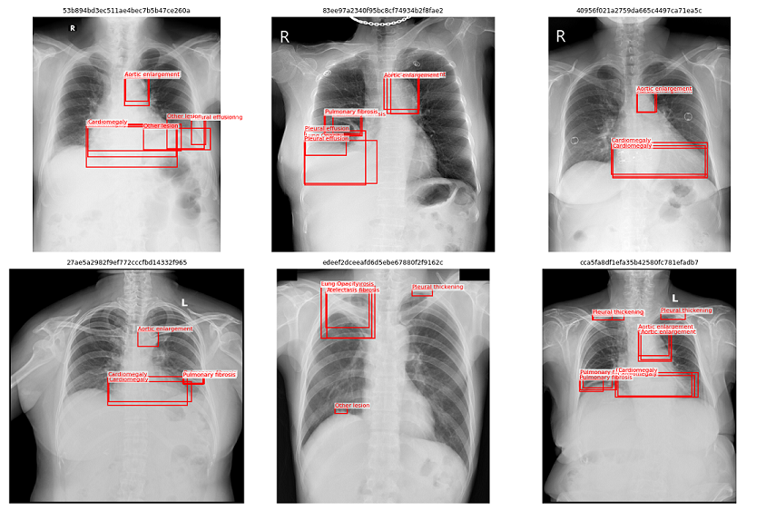
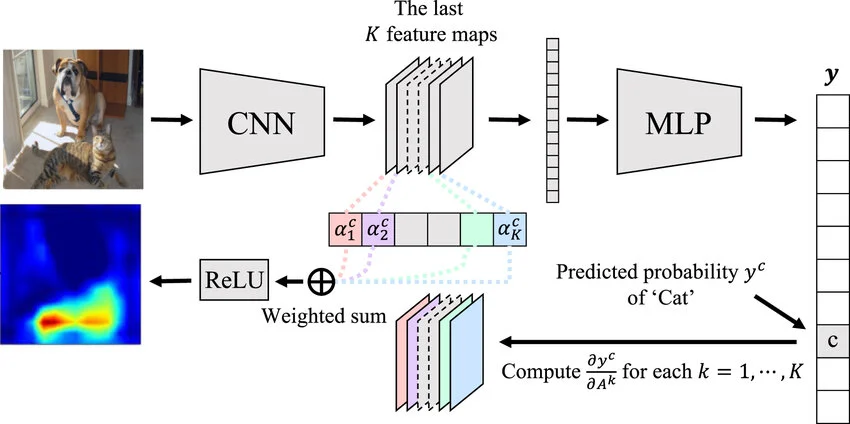
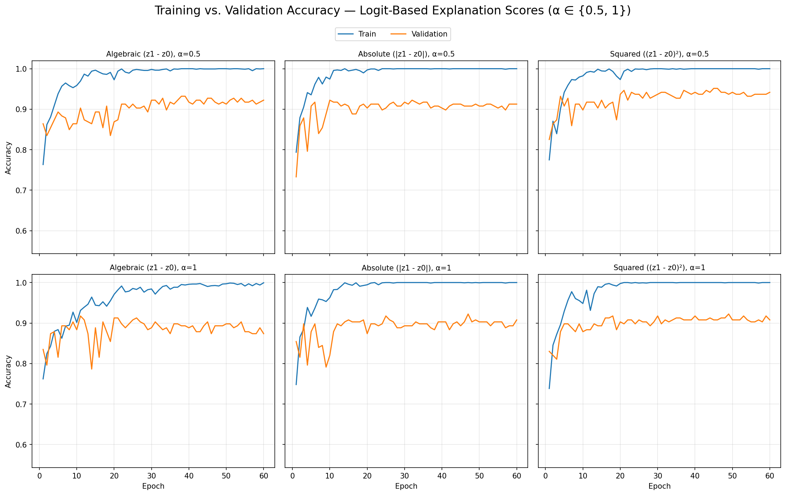
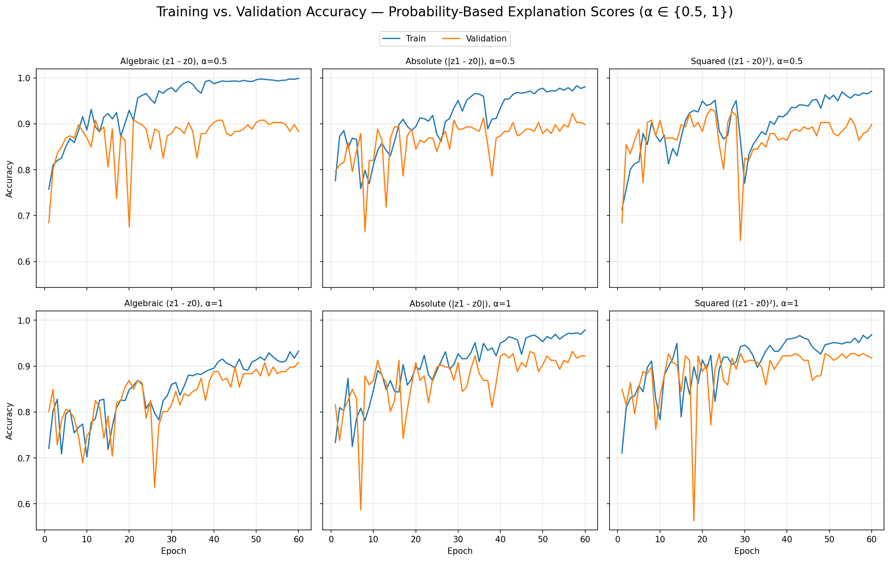
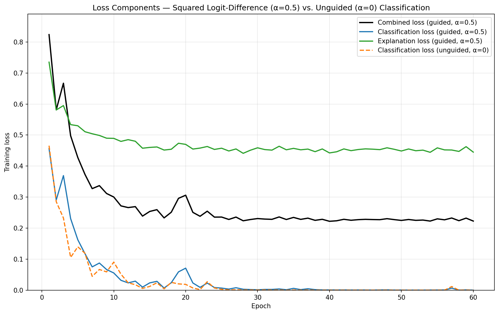

# Explanation-Aware Chest X-ray Classification
## Conclusion 
**Explantation Guided Classification reachs comparable performance to regular classification baseline on the VinDr X-ray Chest Dataset.**<br>Using the **squared logit-difference** explanation score (`score_mode="sqr"`) at **α≈0.5–1**, provided the best results. On held-out test data, `sqr` reaches a classification accuracy of **93%** comparable to the regular BCE trained baseline accuracy of **93%** top-saliency precision of **~0.46**.


## What this is

An implementation and empirical study of explanation-guided training for chest X-ray disease classification on the **VinDr-CXR** dataset, following *"Explanation-Aware Learning for Enhanced Interpretability in Biomedical Imaging"* (Faruqui & Dubey). A DenseNet121 binary classifier is trained per disease with a combined objective:

```
L_total = L_bce + α · L_exp
```

where `L_bce` is the binary cross entropy of the classification results, `L_exp` is a Grad-CAM-based explanation loss that penalizes saliency mass falling outside expert-annotated bounding-box regions, and `α` controls how strongly that supervision shapes training. The project covers the full pipeline: preprocessing → training → evaluation → visualization → a served inference API 
<!--— plus the diagnostic work needed to figure out *why* explanation supervision does or doesn't actually work.-->

## Theoratical Overview
VinDr-CXR dataset contains x-ray images of multiple disease annoated by exparts with bounding-boxes around the important regions for diagnoses of each dieases present.



The goal of the algorithm presented in the paper is to encourage the classifier to focus on the annotated regions when making its predictions. Here, “focus” is quantified using Grad-CAM heatmaps generated by the model.

Grad-CAM is a technique for generating heatmaps that highlight the regions contributing to a classification decision. It uses the feature maps produced by the CNN backbone and weights their activations according to the gradients of the class-specific classification logit. These weighted feature maps are then combined to produce a single spatial heatmap representing the regions that most influenced the model’s prediction.




### Explanation Score Formulations

The paper provides 6 different ways for calculating Grad-CAMs. The weights of the activations can be calculated as gradients of the following scores (s) logit algebraic, logit absolute, and logit squared differences, probability algebraic, probability absolute, and probability squared differences, where z0 and z1 denote the logits of negative and positive classes, repectively, and p0 and p1 correspond to the softmax probabilities for the negative and positive classes, respectively.

**1) Logit-Based Scores**
- $s^{alg}_{logit} = z_1 - z_0$
- $s^{abs}_{logit} = |z_1 - z_0|$
- $s^{sqr}_{logit} = (z_1 - z_0)^2$


**2) Probability-Based Scores**

- $s^{alg}_{prob} = p_1 - p_0$
- $s^{abs}_{prob} = |p_1 - p_0|$
- $s^{sqr}_{prob} = (p_1 - p_0)^2$

### Explanation Loss
After getting the Grad-CAM normalized heatmaps H, a mask H_plus is generated generated highlighting only the top-k% values of the heatmap. The idea is to focus on the most important regions instead of the whole heatmap/reducing noise effect. k is chosen to be 50 in the paper and this project.

The explnantion loss is formulated as the following.

$$
L_{exp} = 1 - \frac{\sum (\hat{H}^+ \odot M)}{\sum \hat{H}^+}
$$

where H_plus is the top-k% heatmap mask, M is the target annotation mask.

### Combined Loss
The total loss is a combination of the binary classification loss and the explanation loss as the following:

$$
L_{total} = L_{bce} + \alpha L_{exp}
$$

where $\alpha$ is a hyperparameter set by the user.

### Evaluation Metrics
In addition to the classification accuracy, the paper considers 3 other evaluation metrics. Top Saliency Percesion, All Saliency Percsion, Annoation Coverage.

1) Top Saliency Percesion:
measures the fraction of the top-k saliency heatmap inside the disease annoated area. We focus on the most relevant two of them.
$$
\text{Precision}_{top} = \frac{\sum_{i,j} \hat{H}^+(i,j)\, M(i,j)}{\sum_{i,j} \hat{H}^+(i,j)}
$$

2) All Saliency Percsion: 
measures the fraction of the total saliency heatmap inside the disease annoated area.
$$
\text{Precision}_{all} = \frac{\sum_{i,j} \hat{H}(i,j)\, M(i,j)}{\sum_{i,j} \hat{H}(i,j)}
$$
## Experiments
 All experiments in this project are conducted as binary classifiction on one selected disease, "Pleural Effusion" in this project. The dataset is subsampled to include an approximate rate of 1:1 positive to negative classes.

 Each training experiment is done on pretrained DenseNet-121 CNN backbone with a binary classification head of output 2 with a dropout rate of 0.3 applied before it. Each model is trained for 60 epochs with a batch size of 12  for training and evaluation due to additional memory usage introduced by the GradCAM-based explanation loss.

Adam Optimizer with a learning rate of 2e-4 and a weight decay of 1e-4 is used in all experiments.

### Baseline (Unguided)
Model with setup mentioned above, only trained on a binary classification loss.


### Guided Models
Models trained on varition of the explanation loss, with different scoring formulations, and different $\alpha$ values (0.5, 1).

Logits-Based Scores
<br>Using logitis produces a consistently smooth and stable convergance across every score mode and every α, as shown below.



Probability-Based Scores
<br>In Contrast, Probabilities produces a visibly noisier training at α=0.5 and α=1 across all three score modes, including some sharp single-epoch drops.



## Key findings

### sqrt-logits based score produces the best results on the testset.

| | Baseline | `sqr` ((z1 − z0)²) |
|---|---|---|
| Explanation loss converges? | **No** — flat/noisy for all 60 epochs | **Yes** — drops in ~10 epochs, plateaus at ~0.44–0.47 |
| Top saliency precision (test) | ~0.18 | ~0.46 |
| All saliency precision (test) | ~0.10 | ~0.20 |
| Classification accuracy/AUC | ~0.93 | ~0.93 |



*(Single diagnostic runs, not averaged over multiple seeds or every disease — see [Limitations](#limitations--open-questions).)*

**Explanation supervision doesn't cost classification performance.** With `sqr` at α=0.5, the classification-loss curve is nearly indistinguishable from a α=0 (unguided) baseline; both collapse to near-zero by epoch ~25. The explanation loss decouples from it and does not degrade it, consistent with the paper's central claim.

**Even the best formulation saturate out well above zero.** `sqr`'s ~0.44–0.47 training-loss floor is wider than the paper's Fig. 2a (although $\alpha$ = 0.25 in the paper's Fig) suggests.

## Repository structure

## Repository structure

```
src/xail/                    # installable package (see pyproject.toml)
  vinbig_prep/                  DICOM preprocessing -> self-describing processed dataset directory
    config.py                     DataConfig (no hashing; fixed output filenames)
    download.py                    Kaggle competition download / auto-detects mounted competition input
    dicom_io.py                     DICOM decode + resize
    annotations.py                   Raw annotation CSV loading/grouping
    masks.py                          Per-disease union bounding-box mask construction
    storage.py                         build_storage() orchestration: builds images.dat/masks.dat/labels.npy
                                        + metadata.json (metadata/open_dataset machinery now lives in
                                        core.data / core.datasets, not here)

  core/                         # Training pipeline (formerly `xai_train/`)
    config.py                     ExperimentConfig -- single flat dataclass for everything (data, model,
                                   loss, training); the earlier DataConfig/ModelConfig/ExplanationLossConfig/
                                   TrainConfig/RunConfig split has been consolidated
    datasets.py                    MetadataDataset, ProcessedDataset, BinaryDiseaseDataset
    data.py                         open_dataset(), DiseaseTaskBuilder (balanced task + stratified split),
                                     build_dataloaders, DiseaseDataModule (single entry point -> 3 DataLoaders)
    model.py                         DenseNet121WithFeatureMap (logits + Grad-CAM feature map)
    losses.py                         ExplanationLoss (Grad-CAM pipeline, soft top-k masking),
                                       CombinedLoss (L_bce + α·L_exp)
    metrics.py                         MetricBundle, ExplanationMetricBundle -- paper's Eq. 7-9:
                                        top/all saliency precision, annotation coverage
    engine.py                           Trainer -- train/val loop, checkpointing, history
    visualize.py                         Training-history plots
    seeding.py                            set_seed()

  api/
    main.py                       FastAPI service: upload an X-ray, get back prediction + heatmap overlay

  build_dataset.py              CLI entry point (typer) for preprocessing

client/
  predict.py                    CLI (typer): calls the API and renders the result

notebooks/
  01_eda.ipynb                  Exploratory data analysis
  02_preprocessing.ipynb          Walks through building the processed dataset via vinbig_prep
  03_training.ipynb                Training + evaluation -- run/evaluate logic lives here directly rather
                                    than as standalone run_experiment.py / evaluate.py / visualize_explanations.py
                                    scripts

runs/                          Saved outputs per (score_mode, alpha, head) combo: history.csv, acc/loss/
                                exp_loss plots, test_results.json, checkpoints
```


## Debug Log

Worth listing explicitly, since these would silently corrupt results rather than crash:

- **Not Recording Explanation loss in the validation**: the classification loss tend to converge early, while the explanation loss takes more epochs to reach it minmum. Not recording it in the validtion run could lead to misreading the model behaviour as overfitting and not generalizing well on the validation data.

- **Combining Masks for multiple disease**: the annoation data provides masks for multiple diseases, a single image could have mask annotations for multiple diseases. User's should be careful to filter annotion boxes for only the selected disease.


## Limitations

- **Not a controlled multi-seed study.** All the experiments were conducted on  a single seed; a more accurate assesment would require running the experiments on multiple seeds.
- **All experiments were conducted on a small portion of the dataset**: the dataset was filter for images containing annotations of Pleural effusion disease and an equal number of subsampled negative images, train set is 1651 image, validation set is 206, and test set is 207. All having an approximatly equal number of positive and negative examples.
